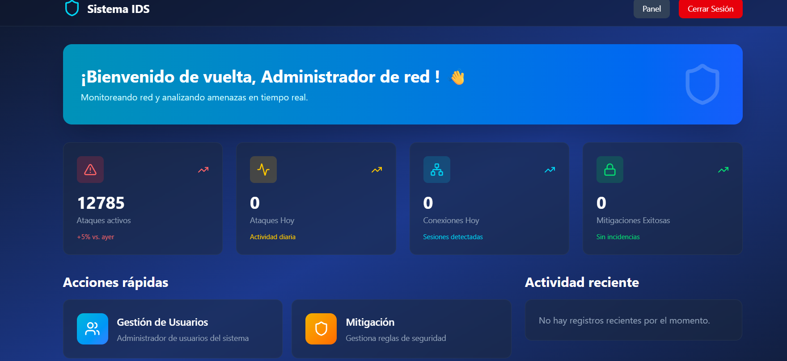

# Sistema de Monitoreo de Red con Machine Learning 🛡️

   
  

Este proyecto es un sistema integral de monitoreo de tráfico de red con capacidades avanzadas de detección de intrusiones y anomalías, potenciado por Machine Learning. Ofrece una plataforma robusta para la vigilancia de la red, la identificación proactiva de amenazas cibernéticas y la gestión de mitigaciones, todo accesible a través de interfaces web y móviles intuitivas.



## ✨ Características Principales

*   **Detección de Intrusiones Avanzada:** 🧠 Incorpora modelos de Machine Learning pre-entrenados con datasets de ciberseguridad (ej. UNSW\_NB15, CIC-IDS-2017) para identificar patrones de tráfico malicioso y anomalías en tiempo real.
*   **Monitoreo en Tiempo Real:** 📊 Utiliza WebSockets (Django Channels y Daphne) para proporcionar actualizaciones instantáneas sobre el tráfico de red, conexiones y ataques detectados en el dashboard.
*   **API RESTful Completa:** 🔗 Backend desarrollado con Django REST Framework para una gestión eficiente de datos de ataques, conexiones, mitigaciones, usuarios y roles.
*   **Dashboard Interactivo (Web):** 🖥️ Interfaz de usuario intuitiva construida con React para visualizar métricas clave, alertas y gestionar el sistema de forma detallada.
*   **Aplicación Móvil (React Native):** 📱 Acceso al monitoreo y notificaciones desde dispositivos móviles, permitiendo una vigilancia en movimiento.
*   **Gestión Integral de Mitigaciones:** ⚙️ Funcionalidad para registrar, rastrear y gestionar las acciones tomadas para contrarrestar los ataques detectados.
*   **Autenticación y Autorización Robusta:** 🔐 Sistema de usuarios y roles para controlar el acceso y los permisos a las diferentes funcionalidades del sistema.
*   **Simulador de Tráfico:** 🚦 Incluye un simulador de tráfico para pruebas y desarrollo, facilitando la experimentación con la detección de intrusiones.

## 🚀 Requisitos Previos

Asegúrate de tener instalado lo siguiente antes de proceder con la instalación:

*   **Python 3.9+**
*   **Node.js LTS** (incluye `npm` o `yarn`)
*   **pip** (gestor de paquetes de Python)
*   **PostgreSQL** (base de datos relacional)
*   **Git**

## 🛠️ Instrucciones de Instalación

Sigue estos pasos para configurar y poner en marcha el proyecto en tu entorno local.

### 1. Clonar el Repositorio
```bash
git clone https://github.com/alejav0240/CoderBits.git
cd tu_repositorio
```

### 2. Configuración del Backend (Django)

Navega al directorio `backend`, configura el entorno virtual, instala dependencias y prepara la base de datos.
```bash
cd backend
python -m venv venv
source venv/bin/activate  # En Windows: .\venv\Scripts\activate

pip install -r requirements.txt

# Configurar la base de datos PostgreSQL

# 1. Crea una base de datos y un usuario en PostgreSQL (ej. 'ids_db', 'ids_user').

# 2. Actualiza 'mi_api_django/settings.py' con tus credenciales de PostgreSQL.

python manage.py makemigrations
python manage.py migrate
python manage.py createsuperuser # Opcional: para crear un usuario administrador
python manage.py runserver
```
El servidor de Django se ejecutará en `http://127.0.0.1:8000/`. Para los WebSockets, deberás iniciar Daphne por separado:
```bash
daphne -b 0.0.0.0 -p 8001 mi_api_django.asgi:application
```
Daphne se ejecutará en `http://127.0.0.1:8001/`. Asegúrate de que tu frontend apunte a esta dirección para las conexiones WebSocket.

### 3. Configuración del Módulo de Machine Learning

Navega al directorio `ML-Analisis`, instala las dependencias y prepara tu entorno para los notebooks.
```bash
cd ML-Analisis
python -m venv venv
source venv/bin/activate  # En Windows: .\venv\Scripts\activate
pip install -r requirements.txt

# Para entrenar o experimentar con los modelos, abre los notebooks de Jupyter:
jupyter notebook
```
Asegúrate de que los modelos `.h5` y `.pkl` generados por este módulo sean accesibles para el backend si se utilizan para inferencia en tiempo real.

### 4. Configuración del Frontend Web (React)

Navega al directorio `front-end` e instala las dependencias de Node.js.
```bash
cd front-end
npm install # o yarn install
npm run dev # o yarn dev
```
El frontend web se ejecutará en `http://localhost:5173/` (o un puerto similar). Asegúrate de que las variables de entorno o la configuración de la API en el frontend apunten correctamente a la URL de tu backend de Django.

### 5. Configuración de la Aplicación Móvil (React Native)

Navega al directorio `rn_Movil`. Asume que ya tienes configurado tu entorno de React Native (Android Studio/Xcode).
```bash
cd rn_Movil

# Si existe un package.json, instala las dependencias:

# npm install # o yarn install

# Luego, ejecuta la aplicación en un emulador o dispositivo:

# npx react-native run-android # Para Android

# npx react-native run-ios     # Para iOS (requiere macOS y Xcode)
```
Asegúrate de que archivos como `base.js` u otros de configuración en la aplicación móvil apunten a la URL correcta de tu backend de Django.

## 💡 Guía de Uso

Una vez que todos los componentes estén en funcionamiento:

1.  **Accede al Dashboard Web:** Abre tu navegador y ve a `http://localhost:5173/` (o el puerto de tu frontend React).
2.  **Inicia Sesión:** Utiliza las credenciales de un usuario creado (ej. el superusuario de Django).
3.  **Monitorea el Tráfico:** Observa las visualizaciones en tiempo real de las conexiones de red y las alertas de ataques.
4.  **Gestiona Ataques y Mitigaciones:** Utiliza las secciones correspondientes para revisar ataques detectados y aplicar medidas de mitigación.
5.  **Simulación (Opcional):** Puedes ejecutar `backend/ataques/traffic_simulator_no_api.py` para simular tráfico y observar cómo el sistema detecta y reacciona a las anomalías.

## 📂 Estructura del Proyecto
```
CoderBits/
├── ML-Analisis/             # Módulo de Machine Learning para análisis y detección de intrusiones
│   ├── Datasets/            # Conjuntos de datos utilizados para el entrenamiento
│   ├── ML/                  # Modelos entrenados (.h5, .pkl)
│   ├── monitor_trafico.py   # Script para monitoreo de tráfico
│   └── requirements.txt     # Dependencias de Python para ML
├── backend/                 # API RESTful con Django, Django Channels y Daphne
│   ├── app/                 # Aplicación Django base
│   ├── ataques/             # Gestión de ataques y consumidores de WebSockets
│   ├── conexiones/          # Monitoreo de conexiones y consumidores de WebSockets
│   ├── dashboard/           # Datos para el dashboard
│   ├── mi_api_django/       # Configuración principal del proyecto Django
│   ├── mitigaciones/        # Gestión de acciones de mitigación
│   ├── personales/          # Gestión de usuarios y autenticación
│   ├── roles/               # Gestión de roles de usuario
│   ├── staticfiles/         # Archivos estáticos
│   ├── manage.py            # Utilidad de línea de comandos de Django
│   └── requirements.txt     # Dependencias de Python para el backend
├── front-end/               # Interfaz de usuario web con React
│   ├── public/              # Archivos públicos
│   ├── src/                 # Código fuente de React
│   │   ├── components/      # Componentes reutilizables
│   │   ├── context/         # Contextos de React (Autenticación, Usuarios)
│   │   ├── features/        # Módulos de características (ataques, tráfico, mitigación)
│   │   ├── layouts/         # Diseños de página
│   │   ├── pages/           # Páginas principales de la aplicación
│   │   └── services/        # Lógica para interactuar con la API
│   ├── package.json         # Dependencias de Node.js para el frontend web
│   └── vite.config.js       # Configuración de Vite
├── rn_Movil/                # Aplicación móvil con React Native
│   └── base.js              # Archivo base de la aplicación móvil (ej. configuración de API)
├── LICENSE                  # Archivo de licencia
└── README.md                # Este archivo
```

## 💻 Tecnologías Utilizadas

*   **Backend:** Python, Django, Django REST Framework, Django Channels, Daphne
*   **Machine Learning:** Python, Jupyter Notebook, TensorFlow, Keras, Scikit-learn, Pandas
*   **Frontend Web:** JavaScript, React, Vite, Axios
*   **Frontend Móvil:** JavaScript, React Native
*   **Base de Datos:** PostgreSQL
*   **Comunicación:** WebSockets


## ⚙️ Configuración (Backend)

1. Clonar repo y crear entorno:

```bash
git clone <repo-url>
cd CoderBits
python -m venv venv
# activar
# Windows:
venv\Scripts\activate
# Linux / macOS:
source venv/bin/activate
```

2. Instalar dependencias:

```bash
pip install -r requirements.txt
```

3. Variables de entorno: crea un `.env` en la raíz (usa .env.example como guía):

```
SECRET_KEY=tu_secret_key
DB_NAME=nombre_bd
DB_USER=usuario
DB_PASSWORD=contraseña
DB_HOST=localhost
DB_PORT=5432
DJANGO_DEBUG=True
ALLOWED_HOSTS=127.0.0.1,localhost
```

4. Crear BD y migraciones:

```bash
# crear migraciones
python manage.py makemigrations
# aplicar migraciones
python manage.py migrate
# aplicar todas (si tienes script)
python migrate_all.py
```

5. Cargar datos iniciales (si aplica):

Ejecutar `postgresql_IDS.sql` en tu instancia de PostgreSQL para poblar datos iniciales.

6. Crear superusuario Django:

```bash
python manage.py createsuperuser
# abrir http://127.0.0.1:8000/admin/
```

---

## 🚀 Run (Desarrollo)

* Servidor Django (dev):

```bash
python manage.py runserver
```

* Servidor ASGI con Daphne (WebSockets):

```bash
daphne -p 8000 mi_api_django.asgi:application
```

* Visitar:

  * API: `http://127.0.0.1:8000/api/`
  * Admin: `http://127.0.0.1:8000/admin/`

---

## 📡 Captura de red (Sniffer)

* La captura puede activarse desde el panel admin o programáticamente:

```python
from conexiones.monitoreo import monitor_activo
monitor_activo = True  # o False
```

* Los flujos capturados se guardan en la tabla `Conexion`.
* Para ejecutar el sniffer local con Scapy (ejemplo):

```bash
sudo python monitor_cicids.py  # script de ejemplo que extrae 78 features y hace inferencia
```

---

### Funcionalidades principales del frontend

* Dashboard en tiempo real (con WebSocket)
* Panel para activar/desactivar monitoreo
* Visualización de conexiones y ataques detectados
* Páginas de administración (usuarios, roles, mitigaciones)
* Reportes y export (JSON/CSV)

---

## 🔗 Endpoints principales (resumen)

### Conexiones

* `GET /api/conexiones/`
* `GET /api/conexiones/<id>/`
* `POST /api/conexiones/activar_monitoreo/`
* `POST /api/conexiones/desactivar_monitoreo/`
* `POST api/conexiones/iniciar_automatico/`
* `POST api/conexiones/detener_automatico/`

### Personal / Roles

* `GET /api/personales/`, `POST /api/personales/`, `GET/PUT/DELETE /api/personales/<id>/`
* `POST /api/personales/login_personal/`
* `api/logout_personal/`

### Ataques / Mitigaciones

* `GET /api/ataques/`, `GET /api/ataques/<id>/`
* `GET /api/mitigaciones/`, `POST /api/mitigaciones/<id>/activar/`, `POST /api/mitigaciones/<id>/desactivar/`

### Dashboard / Reportes

* `GET /api/dashboard/stats/`
* `GET /api/dashboard/export/json/`

### WebSockets

* `ws://127.0.0.1:8000/ws/monitoreo/` — eventos de conexiones en tiempo real
* `ws://127.0.0.1:8000/ws/alertas/` — alertas de seguridad / ataques detectados